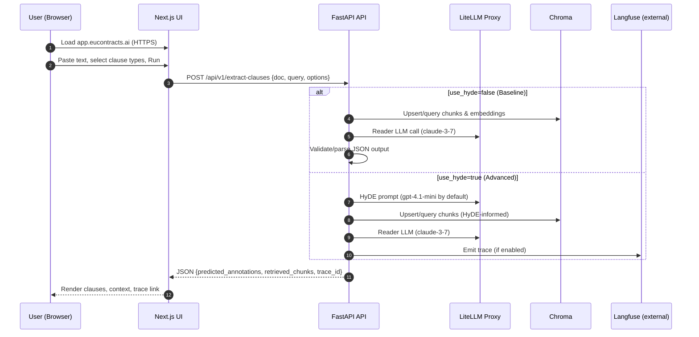
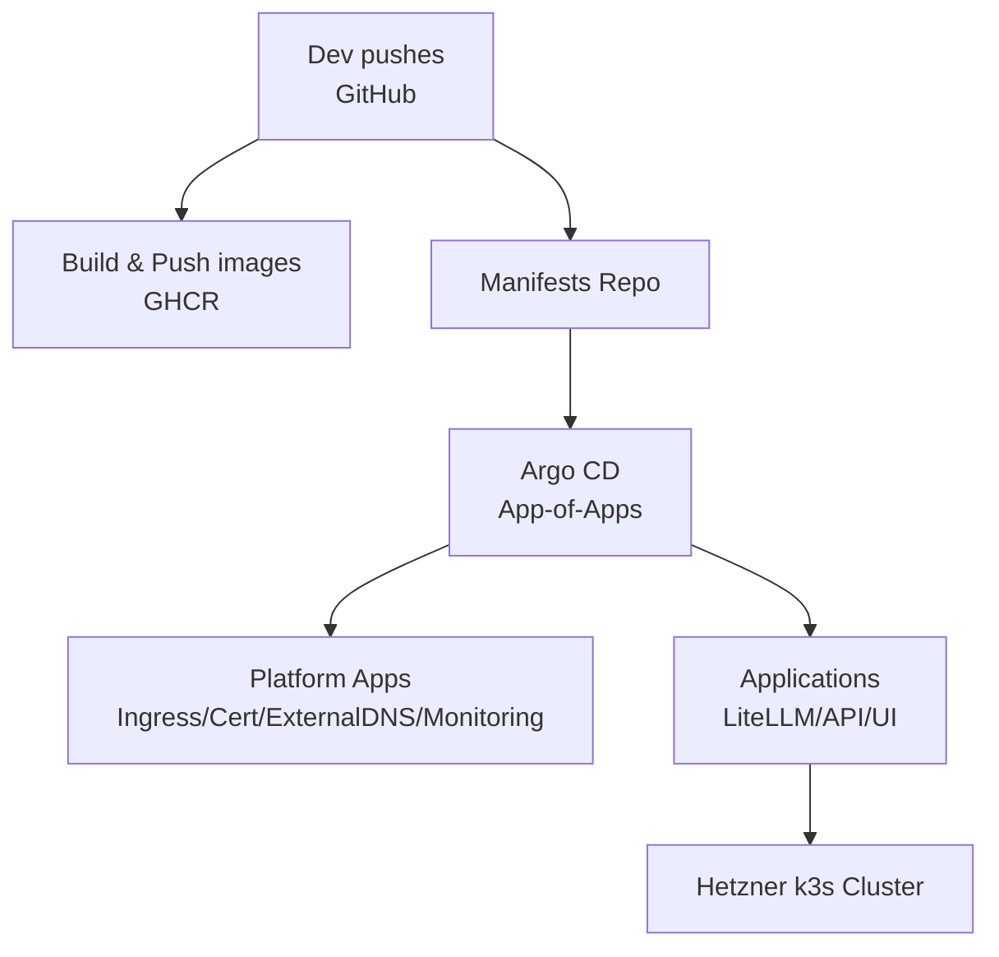
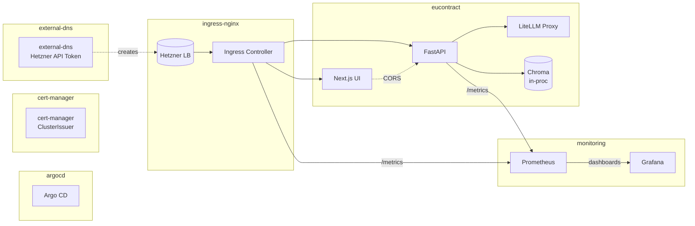

# EUContracts — Architecture & Visualization

A single-page guide to understand, operate, and extend the demo-ready EUContracts stack on Hetzner k3s using GitOps, with a sleek UI, a simple API, and built-in observability.

Key code references
- API service (FastAPI): [api/main.py](api/main.py)
  - Pipelines: Baseline [run_rag_clause_extraction()](src/poc2_rag_pipeline.py:359), Advanced (HyDE) [run_advanced_rag_pipeline()](src/poc4_advanced_rag_pipeline.py:71)
- LiteLLM config (model routing aliases): [src/config/litellm_config.yaml](src/config/litellm_config.yaml)
- UI (Next.js): [ui/pages/index.tsx](ui/pages/index.tsx)
- Helm charts:
  - API: [deploy/charts/api-service](deploy/charts/api-service)
  - UI: [deploy/charts/ui](deploy/charts/ui)
  - LiteLLM: [deploy/charts/litellm-proxy](deploy/charts/litellm-proxy)
- GitOps (Argo CD):
  - Root: [deploy/gitops/app-of-apps.yaml](deploy/gitops/app-of-apps.yaml)
  - Platform apps: [deploy/gitops/apps/platform.yaml](deploy/gitops/apps/platform.yaml)
  - App stack: [deploy/gitops/apps/apps.yaml](deploy/gitops/apps/apps.yaml)
- TLS & Ingress:
  - ClusterIssuer: [deploy/platform/cert-manager/clusterissuer.yaml](deploy/platform/cert-manager/clusterissuer.yaml)
  - Ingress NGINX values (Hetzner LB settings): [deploy/platform/ingress-nginx/values.yaml](deploy/platform/ingress-nginx/values.yaml)
- Grafana dashboards: [deploy/platform/monitoring/dashboards/eucontracts-dashboards.yaml](deploy/platform/monitoring/dashboards/eucontracts-dashboards.yaml)

---

## 1) System map (what’s running, where)

```mermaid
flowchart TD
  subgraph User
    U[Browser\nDemo user]
  end

  subgraph Hetzner k3s Cluster
    subgraph ingress-nginx
      LB[(Hetzner Cloud LB)]:::lb --> IN[Ingress NGINX\n(proxy-protocol, TLS)]
    end

    subgraph eucontract[Namespace: eucontract]
      UI[Next.js UI\n(app.eucontracts.ai)]
      API[FastAPI Service\n(api.eucontracts.ai)]
      LITELLM[LiteLLM Proxy\nClusterIP:4000]
      CHROMA[(Chroma\nin-process/PVC)]
    end

    subgraph monitoring[Namespace: monitoring]
      PROM[Prometheus]
      GRAF[Grafana]
    end

    subgraph cert-manager[Namespace: cert-manager]
      CM[cert-manager\nClusterIssuer]
    end

    subgraph external-dns[Namespace: external-dns]
      EDNS[external-dns\n(Hetzner provider)]
    end

    subgraph argocd[Namespace: argocd]
      ARGO[Argo CD]
    end
  end

  U -->|HTTPS| IN
  IN --> UI
  IN --> API

  API -->|HTTP :4000| LITELLM
  API --> CHROMA
  API -.->|Traces| LANGFUSE[(Langfuse SaaS\nlf.eucontracts.ai)]

  IN -->|metrics| PROM
  API -->|/metrics| PROM
  LITELLM -->|/metrics (n/a)| PROM

  GRAF <--> PROM

classDef lb fill:#111,stroke:#0ff,stroke-width:1px,color:#0ff;
```

Highlights
- One cluster & one namespace (eucontract) for app components keeps ops simple.
- Ingress NGINX uses Hetzner LB with proxy protocol for real client IPs.
- external-dns manages DNS records for app/api hosts in Hetzner DNS.
- kube-prometheus-stack (Prom/Grafana) provides metrics and dashboards.

---

## 2) Request lifecycle (end-to-end)



---

## 3) RAG pipeline internals (what happens inside)

```mermaid
flowchart LR
  A[Document Text] --> B[Chunking\nsize=1000, overlap=150]
  B --> C[Embeddings\n(text-embedding-3-small)]
  C --> D[Vector Store\nChroma]
  E[Query or HyDE text] --> F[Retrieval\nTop-K=5]
  D --> F
  F --> G[Reader LLM\n(claude-3-7)]
  G --> H[JSON Validate & Parse]
  H --> I[Annotations]
```

- Baseline pipeline: [run_rag_clause_extraction()](src/poc2_rag_pipeline.py:359)
- Advanced (HyDE) pipeline: [run_advanced_rag_pipeline()](src/poc4_advanced_rag_pipeline.py:71)
- JSON parsing & schema validation: [validate_and_parse_json()](src/poc2_rag_pipeline.py:170)

---

## 4) GitOps deployment (how it’s delivered)



- Root application: [app-of-apps.yaml](deploy/gitops/app-of-apps.yaml)
- Platform apps: [platform.yaml](deploy/gitops/apps/platform.yaml)
- App stack: [apps.yaml](deploy/gitops/apps/apps.yaml)

---

## 5) Deployment topology (namespaces and networking)



---

## 6) Observability (metrics and dashboards)

Exposed metrics
- API: http_request_duration_seconds (route/method/status), rag_stage_duration_seconds (per stage), rag_errors_total, llm_tokens_total (scaffold)
- Ingress NGINX: controller & request metrics enabled via ServiceMonitor
- Grafana dashboards: [eucontracts-dashboards.yaml](deploy/platform/monitoring/dashboards/eucontracts-dashboards.yaml)

Targets and SLO hints
- p95 end-to-end < 7s on curated sample (visible in API Overview dashboard)
- Stage-level breakdown in RAG Stages dashboard
- Token usage trends in LLM Usage dashboard

---

## 7) Secrets & configuration (minimal, SOPS-managed)

Secrets to provide (names referenced in Helm values)
- LiteLLM provider keys (namespace eucontract)
  - Secret: litellm-api-keys → ANTHROPIC_API_KEY, OPENAI_API_KEY
- Langfuse keys (namespace eucontract; external instance)
  - Secret: langfuse-keys → LANGFUSE_PUBLIC_KEY, LANGFUSE_SECRET_KEY
- ExternalDNS Hetzner token (namespace external-dns)
  - Secret: external-dns-hetzner-token → token

Configuration knobs
- API defaults in [deploy/charts/api-service/values.yaml](deploy/charts/api-service/values.yaml)
  - Use HyDE (off by default), model aliases, proxy URL, allowed origins
- Ingress annotations for Hetzner LB in [deploy/platform/ingress-nginx/values.yaml](deploy/platform/ingress-nginx/values.yaml)
- ClusterIssuer ACME email in [deploy/platform/cert-manager/clusterissuer.yaml](deploy/platform/cert-manager/clusterissuer.yaml)

---

## 8) API quick reference

Base URL
- https://api.eucontracts.ai

Endpoints
- GET /api/v1/health → status, defaults, reachability
- GET /api/v1/models → available LiteLLM aliases and defaults
- GET /metrics → Prometheus exposition
- POST /api/v1/extract-clauses
  Request
  {
    "document_id": "gdpr-article-1",
    "document_text": "...",
    "user_query": "Extract ...",
    "clause_types": ["Definitions","Penalties"],
    "language": "en",
    "options": {
      "use_hyde": false,
      "top_k": 5,
      "reader_model": "claude-3-7",
      "embedding_model": "text-embedding-3-small"
    }
  }
  Response
  {
    "predicted_annotations": [{"clause_type": "Definitions", "clause_text":"..."}],
    "retrieved_chunks": ["..."],
    "reader_llm_output_raw": "...",
    "trace_id": "lf_...",
    "timings": {"chunk_ms": null, "embed_ms": null, "retrieve_ms": null, "read_ms": 1820.2},
    "model_info": {"reader_model":"claude-3-7","embedding_model":"text-embedding-3-small","use_hyde": false}
  }

---

## 9) Operate (quick runbook)

Provision Hetzner k3s (HA) with hetzner-k3s CLI
- Create cluster_config.yaml (masters across fsn1/hel1/nbg1; 1–2 workers)
- hetzner-k3s create --config cluster_config.yaml | tee create.log

Install Argo CD and bootstrap GitOps
- kubectl -n argocd apply -f deploy/gitops/app-of-apps.yaml
- Ensure repoURL paths point to this repo in:
  - Root: [deploy/gitops/app-of-apps.yaml](deploy/gitops/app-of-apps.yaml)
  - Platform apps: [deploy/gitops/apps/platform.yaml](deploy/gitops/apps/platform.yaml)
  - App stack: [deploy/gitops/apps/apps.yaml](deploy/gitops/apps/apps.yaml)

Provide secrets (SOPS)
- external-dns (Hetzner token), langfuse keys, litellm provider keys

Wait for:
- ingress-nginx EXTERNAL-IP (kubectl -n ingress-nginx get svc)
- cert-manager ready, ClusterIssuer applied
- external-dns to create api/app DNS records

Validate
- curl https://api.eucontracts.ai/api/v1/health → ok
- Navigate https://app.eucontracts.ai → run sample
- Open Grafana → check API Overview, RAG Stages, LLM Usage

---

## 10) Learn the code (reading map)

Start with the API service
- Routing and models: [api/main.py](api/main.py)
  - Extraction flow: [extract_clauses()](api/main.py:245)
  - Metrics: [metrics()](api/main.py:239) & middleware [prometheus_http_middleware](api/main.py:96)

Pipelines (RAG and Advanced)
- Baseline: [run_rag_clause_extraction()](src/poc2_rag_pipeline.py:359)
- Advanced (HyDE): [run_advanced_rag_pipeline()](src/poc4_advanced_rag_pipeline.py:71)
- JSON validation: [validate_and_parse_json()](src/poc2_rag_pipeline.py:170)

Model routing (LiteLLM)
- Aliases and providers: [src/config/litellm_config.yaml](src/config/litellm_config.yaml)

UI
- Demo page & API calls: [ui/pages/index.tsx](ui/pages/index.tsx)

Deploy
- Helm + values: [deploy/charts/*](deploy/charts)
- GitOps Applications: [deploy/gitops/*](deploy/gitops)

---

## 11) Extensibility (what to add next)

- Persistent vector DB (Qdrant/pgvector) behind API for multi-doc retrieval
- Argo CD Image Updater for automatic image tag bumps
- Autoscaling (HPA) for API based on CPU/RPS
- Canary or blue/green (Argo Rollouts) for safe releases
- More robust token usage capture → llm_tokens_total counters with per-model costs chart

---

Appendix: Metrics names and panels mapping
- api-overview
  - p95 latency: histogram_quantile(0.95, sum by (le) (rate(http_request_duration_seconds_bucket[5m])))
  - RPS: sum(rate(http_request_duration_seconds_count[5m]))
  - Error rate: 100 * sum(rate(http_request_duration_seconds_count{status=~"5.."}[5m])) / sum(rate(http_request_duration_seconds_count[5m]))
- rag-stages
  - p95 by stage: histogram_quantile(0.95, sum by (le, stage) (rate(rag_stage_duration_seconds_bucket[5m])))
  - mean by stage: sum(rate(rag_stage_duration_seconds_sum[5m])) / sum(rate(rag_stage_duration_seconds_count[5m]))
- llm-usage
  - tokens/min by model/role: sum by (model, role) (rate(llm_tokens_total[5m]))