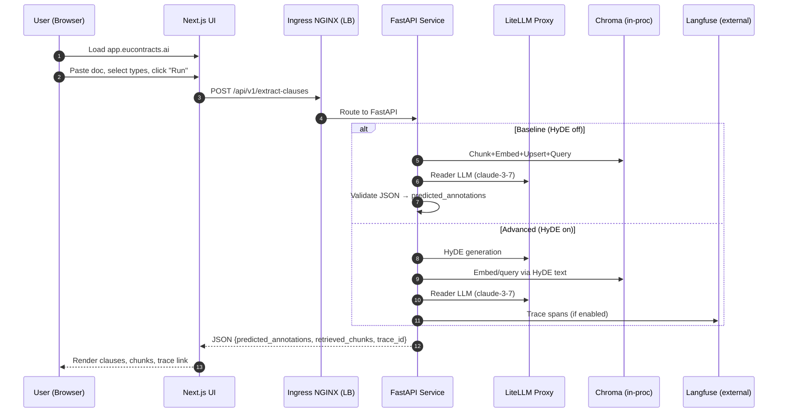
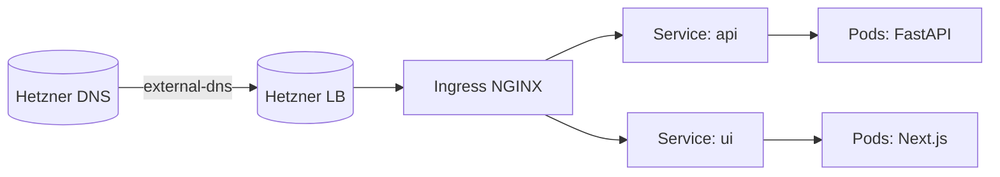

# EUContracts — Visual Learning Guide

A visual-first companion to quickly understand, operate, and extend this demo stack. Start here if you want a guided walk-through with diagrams, links, and a step-by-step learning path.

Key source references
- API entrypoint: [api/main.py](../api/main.py)
- Baseline RAG: [run_rag_clause_extraction()](../src/poc2_rag_pipeline.py:359)
- Advanced RAG (HyDE): [run_advanced_rag_pipeline()](../src/poc4_advanced_rag_pipeline.py:71)
- Model routing config: [src/config/litellm_config.yaml](../src/config/litellm_config.yaml)
- UI root page: [ui/pages/index.tsx](../ui/pages/index.tsx)
- Helm charts:
  - API chart: [deploy/charts/api-service](../deploy/charts/api-service)
  - UI chart: [deploy/charts/ui](../deploy/charts/ui)
  - LiteLLM chart: [deploy/charts/litellm-proxy](../deploy/charts/litellm-proxy)
- GitOps:
  - Root App-of-Apps: [deploy/gitops/app-of-apps.yaml](../deploy/gitops/app-of-apps.yaml)
  - Platform apps: [deploy/gitops/apps/platform.yaml](../deploy/gitops/apps/platform.yaml)
  - Application stack: [deploy/gitops/apps/apps.yaml](../deploy/gitops/apps/apps.yaml)

---

## 0) 10-minute mental model

```mermaid
flowchart TD
  User[User\nBrowser] --> UI[Next.js UI\napp.eucontracts.ai]
  UI --> API[FastAPI\napi.eucontracts.ai]
  API --> LITELLM[LiteLLM Proxy\nModel Routing]
  API --> VDB[(Chroma Vector DB)]
  API -.-> LF[Langfuse\nTraces (external)]
  INGRESS[Ingress NGINX + Hetzner LB] --> UI
  INGRESS --> API
  PROM[Prometheus] <-- /metrics --> API
  PROM <-- metrics --> INGRESS
  PROM --> GRAF[Grafana Dashboards]
```

- UI: paste text, choose models, run.
- API: chunk, embed, retrieve, LLM-read → return JSON list of clauses.
- LiteLLM: route to Claude 3.7, embeddings, optional HyDE model.
- Observability: Prometheus & Grafana; explicit /metrics, ingress metrics too.

---

## 1) Request lifecycle (one concrete run)



---

## 2) RAG internals: Baseline vs Advanced

```mermaid
flowchart LR
  subgraph Baseline
  A1[Doc Text] --> B1[Chunk (1000/150)]
  B1 --> C1[Embeddings: text-embedding-3-small]
  C1 --> D1[(Chroma)]
  D1 --> E1[Retrieval (K=5)]
  E1 --> F1[Reader LLM: claude-3-7]
  F1 --> G1[Validate JSON → Clauses]
  end

  subgraph Advanced (HyDE)
  A2[User Query] --> B2[HyDE (gpt-4.1-mini by default)]
  B2 --> C2[Hypothetical paragraph]
  C2 --> D2[Embed & Retrieve]
  D2 --> F2[Reader LLM: claude-3-7]
  F2 --> G2[Validate JSON → Clauses]
  end
```

- Baseline: fast & reliable, HyDE off → good default for p95 latency target.
- Advanced: higher quality in hard cases, HyDE on → more tokens/latency.

Key code: Baseline [run_rag_clause_extraction()](../src/poc2_rag_pipeline.py:359) vs Advanced [run_advanced_rag_pipeline()](../src/poc4_advanced_rag_pipeline.py:71)

---

## 3) GitOps wave: how everything gets to the cluster

```mermaid
flowchart TD
  DevPush[Push to GitHub] --> CI[Build Docker\nPush GHCR]
  DevPush --> GitOpsRepo[Manifests Repo]
  GitOpsRepo --> Root[Argo CD App-of-Apps\n(deploy/gitops/app-of-apps.yaml)]
  Root --> PlatformApps[Platform Apps\nIngress, Cert, ExternalDNS, Monitoring]
  Root --> AppStack[Apps\nLiteLLM, API, UI]
  PlatformApps --> Cluster[k3s @ Hetzner]
  AppStack --> Cluster
```

Edit these to point to your repo:
- Root: [deploy/gitops/app-of-apps.yaml](../deploy/gitops/app-of-apps.yaml)
- Platform: [deploy/gitops/apps/platform.yaml](../deploy/gitops/apps/platform.yaml)
- Apps: [deploy/gitops/apps/apps.yaml](../deploy/gitops/apps/apps.yaml)

---

## 4) Networking topography (ingress, TLS, DNS)



- Ingress class: nginx
- TLS issuer: ClusterIssuer letsencrypt-prod
- DNS automated: external-dns (Hetzner)

Ingress NGINX LB annotations at: [deploy/platform/ingress-nginx/values.yaml](../deploy/platform/ingress-nginx/values.yaml)

---

## 5) Observability panels (read them like this)

Dashboards provided at [deploy/platform/monitoring/dashboards/eucontracts-dashboards.yaml](../deploy/platform/monitoring/dashboards/eucontracts-dashboards.yaml)

- API Overview
  - p95 latency (s): histogram_quantile over http_request_duration_seconds
  - RPS: rate(http_request_duration_seconds_count)
  - Error rate: 5xx fraction
- RAG Stages
  - p95 by stage, mean by stage from rag_stage_duration_seconds
- LLM Usage
  - tokens/min by model,role from llm_tokens_total

Prometheus scrape targets:
- /metrics on API (enabled via ServiceMonitor)
- ingress-nginx controller metrics (enabled in chart values)

---

## 6) What to tweak (safe knobs)

- API defaults (models, origins, HyDE):
  - [deploy/charts/api-service/values.yaml](../deploy/charts/api-service/values.yaml)
- UI API base:
  - [deploy/charts/ui/values.yaml](../deploy/charts/ui/values.yaml)
- LiteLLM aliases & providers:
  - [deploy/charts/litellm-proxy/values.yaml](../deploy/charts/litellm-proxy/values.yaml)
  - or source config: [src/config/litellm_config.yaml](../src/config/litellm_config.yaml)
- ACME e-mail & TLS:
  - [deploy/platform/cert-manager/clusterissuer.yaml](../deploy/platform/cert-manager/clusterissuer.yaml)
- Ingress class & LB:
  - [deploy/platform/ingress-nginx/values.yaml](../deploy/platform/ingress-nginx/values.yaml)

---

## 7) Learning path (hands-on)

1) Run UI & API locally (optional):
   - API: uvicorn [api.main:app](../api/main.py) on :8080
   - UI: npm install && npm run dev in [ui](../ui/package.json)
2) Build & push images (GHCR)
3) Provision k3s (hetzner-k3s CLI)
4) Apply Argo CD root: [app-of-apps.yaml](../deploy/gitops/app-of-apps.yaml)
5) Provide Secrets (SOPS):
   - external-dns token, LiteLLM keys, Langfuse keys
6) Validate: health endpoint, UI demo run, Grafana panels

---

## 8) FAQ (short)

- Q: Claude vs Gemma vs GPT in this demo?
  - A: Reader defaults to Claude 3.7; embeddings to text-embedding-3-small; HyDE (if enabled) can use gpt-4.1-mini. All routed via LiteLLM aliases; change in values.
- Q: Where are traces?
  - A: External Langfuse (lf.eucontracts.ai). API attaches trace_id when Advanced pipeline is used; Baseline returns rag_trace_id.
- Q: Can I get persistent multi-doc retrieval?
  - A: Swap Chroma in-proc for Qdrant/pgvector and index documents in a collection; API can be extended with a document ingestion endpoint.

---

## 9) Glossary

- HyDE: Hypothetical Document Embeddings; query expansion by generating a synthetic paragraph.
- LiteLLM: Model gateway for normalized API to Anthropic/OpenAI/Gemini/etc.
- ServiceMonitor: CRD used by Prometheus Operator to scrape metrics from services.
- App-of-Apps: Argo CD pattern where one Application manages child Applications.

---

## 10) Where to read the code next

- Start API: [extract_clauses()](../api/main.py)
- Baseline RAG: [run_rag_clause_extraction()](../src/poc2_rag_pipeline.py:359) and [validate_and_parse_json()](../src/poc2_rag_pipeline.py:170)
- Advanced RAG (HyDE): [run_advanced_rag_pipeline()](../src/poc4_advanced_rag_pipeline.py:71)
- Model aliases: [src/config/litellm_config.yaml](../src/config/litellm_config.yaml)
- UI call-site: fetch() in [ui/pages/index.tsx](../ui/pages/index.tsx)

---

## 11) Extensibility ideas

- Add /api/v1/ingest to persist documents across sessions; query across collection.
- Add Argo CD Image Updater or CI-based values bumping for zero-touch deploys.
- Add Argo Rollouts for safe canary; integrate p95 and error SLOs for gating.

Happy hacking — the system is designed to be changed incrementally and safely using GitOps.